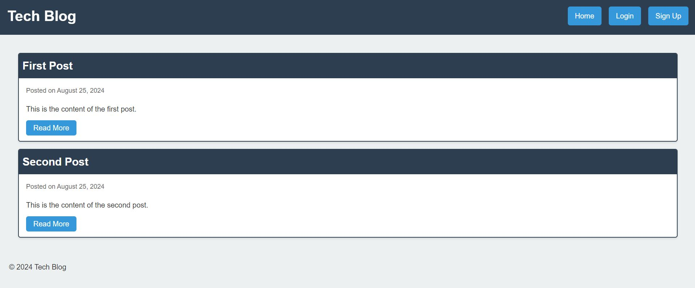

# Tech-Blog

## Description

The Tech-Blog is a fully functional Blogging site including user signup and authentication, user posts including editing and deleting posts, and user commenting on other user's posts. The application's folder structure follows the Model-View-Controller (MVC) paradigm. It uses the express-handlebars package to implement Handlebars.js for the Views. It uses the pg and Sequelize packages to connect to a PostgreSQL database for the Models, and create an Express.js API for the Controllers. It also uses the dotenv package to use environment variables, the bcrypt package to hash passwords, and the express-session and connect-session-sequelize packages to add authentication. 

## Usage 

The finished app will be deployed at a live URL which can be viewed in a browser. 

## Screenshot

## Link to Live URL
[Click to visit site](https://tech-blog-95af.onrender.com/)

